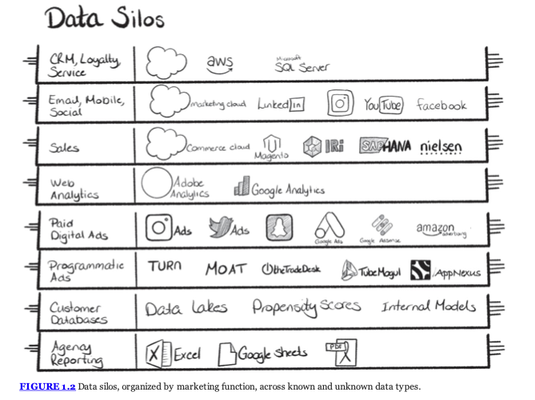

# cdp-notes

Notes on CDP related stuff.

## Reference

参考书:

- CDP: [Customer Data Platforms: Use People Data to Transform the Future of Marketing Engagement, Martin Kihn, Christopher B. O'Hara - Wiley, Dec. 2020](https://www.wiley.com/en-us/Customer+Data+Platforms%3A+Use+People+Data+to+Transform+the+Future+of+Marketing+Engagement-p-9781119790112)

## Existing Products

CDP 里的一幅图:

## Unomi

Apache 的, Java 写的...

https://unomi.apache.org/

- [first impression](./unomi/first-impression.md)
- [data-model](./unomi/data-model.md)

## TreasureData related

CDP 行业的大公司. 感觉技术团队在日本, 他们的开源项目基本是日本大牛在主导, 也用了很多 Ruby.

乍一看很多开源项目, 但是它们没有触及核心业务(用户数据如何存储和管理), 所以其实作用不大.

(但还是有些参考价值, 许多工具都涉及了大规模的数据转移或者查询)

- [CDP concepts by TreasureData](./treasuredata/concepts.md)
- [Opensourced projects](./treasuredata/opensourced.md)

## RudderStack

号称开源 CDP 领头羊.

- [Architecture Overview](./rudder/arch.md)

## Tracardi

三个 repo:

- [Tracardi/tracardi](https://github.com/Tracardi/tracardi): 包含了 model 定义和 elasticsearch 的交互, 里面的`domain`文件夹里包含了定义
  - 学到了很实用的库: `pydantic`
- [Tracardi/tracardi-api](https://github.com/Tracardi/tracardi-api): 接收 event, 提供 api
  - http 框架是 fastapi
- [Tracardi/tracardi-gui](https://github.com/Tracardi/tracardi-gui): react, workflow 的 gui 很有意思

tracardi 有这么几个概念:

- Event
- Profile (也有 merge 的操作)
- Consent (用户同意条款)

tracardi 并不基于传统数据库, 而是 elasticsearch.

我有种感觉, tracardi 是 Unomi 的 python 版本.
