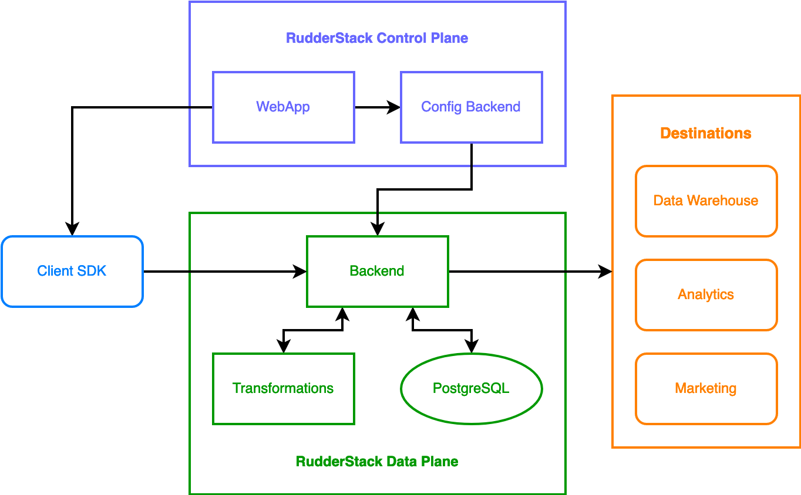
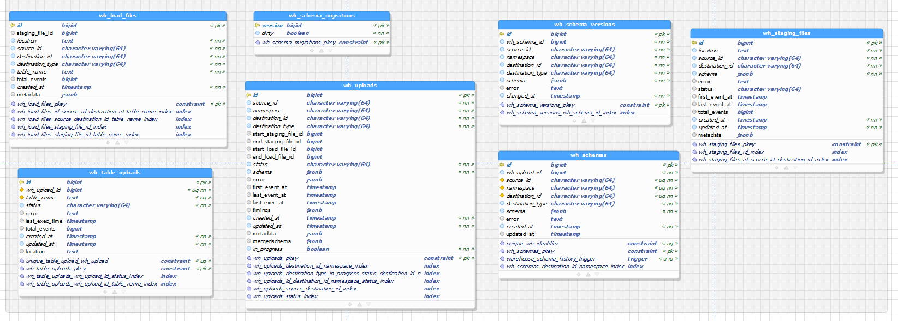

# Architecture Overview

- Client SDK: web 和手机端都有,用来发送 event.
- RudderStack Data Plane: 后端
  - Backend: 一个 go 服务器用来接收 client 发来的 event, 存入 DB
  - Transformations: 一个 nodejs 服务器, 能根据 event 最终存储的 Destination, 转化自己的格式, 基本都是 json.
    - 有意思的是里面有很多依靠`pprof`的 profiling, 作为系统监控的一部分, 不知道是什么让开发者这么介意服务器的运行状况.
- RudderStack Control Plane: 前端, 用来实时查看和控制 Data Plane, 未开源, 需要自己根据后端写
- Destinations: 数据库/仓库(ElasticSearch, Postgres, AWS Snowflake) 或者 一些 CRM/服务(Salesforce? Mailchimp?)

个人乍一看就是一个日志搜集器, 分析还是要靠别家服务. 可能他们未开源的 transformation 里面有更多处理, 因为如果只是转换数据的格式, 单独独立出一个 nodejs 服务器有些不自然(可能不想妨碍 event 搜集功能正常工作也是一个原因, destination 的平台要是更改 API, 服务就会报错.)

## Data Model in Data Warehouse

数据导入到 Data Warehouse 时的样子, 是 postgres.

不确定, 来自我的同事.

